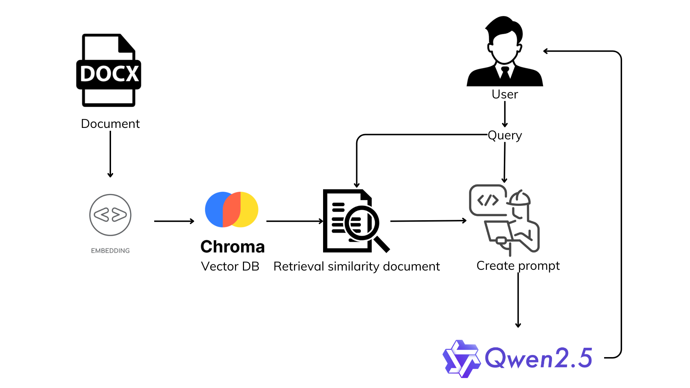
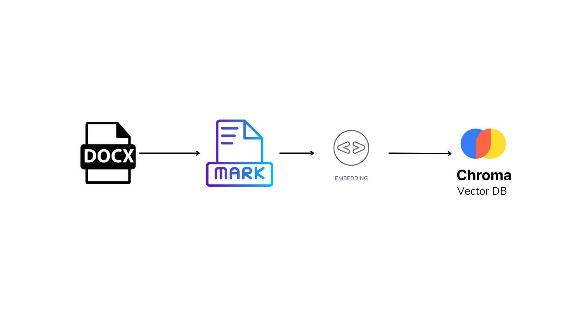
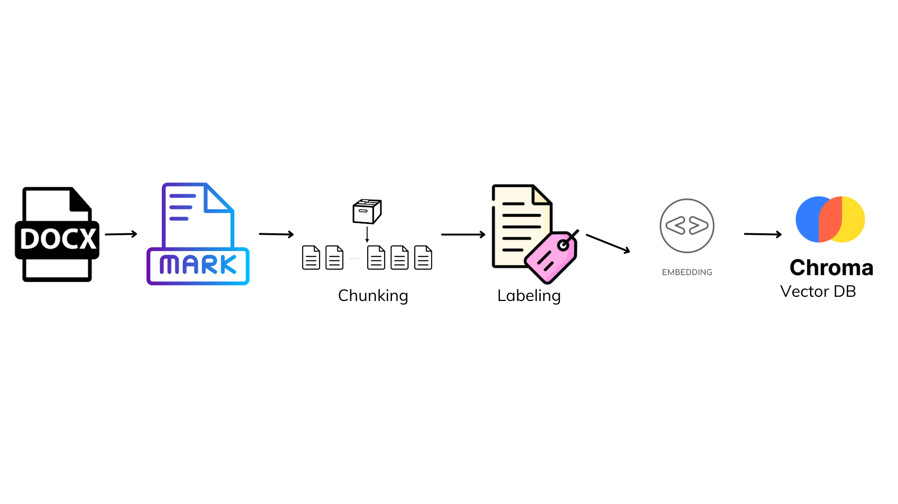
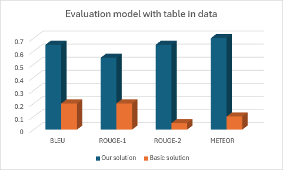
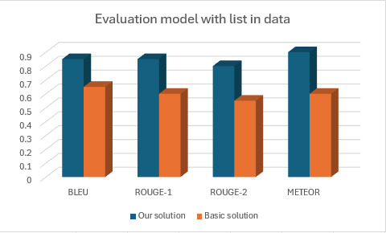
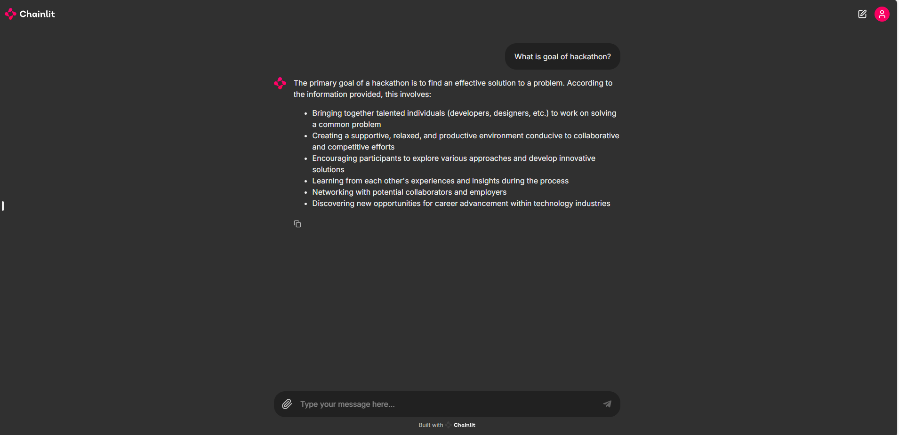

# QA Chatbot for retrieval information from file word


> [!IMPORTANT]
> Disclaimer:
> The app has been tested on:
>   * `Ubuntu 22.04.2 LTS` running on a `10th Gen Intel® Core™ i5-10500U` and an `NVIDIA GeForce RTX 1660 Super`.

> [!WARNING]
> - To run this program. You need to install Cuda compatible with Pytorch which the program is using is 2.5.1
> - It's important to note that the language model sometimes generates hallucinations or false information.

## Table of contents

- [Introduction](#introduction)
- [What's new in the system](#whats-new-in-the-system)
    -[Current issue](#current-issue)
    -[Our Soution](#our-solution)
    -[Evaluation](#evaluation)
- [Prerequisites](#prerequisites)
- [Installation](#installation)
- [Usage](#usage)
- [Example](#example)
- [Data](#data)
- [Contact](#contact)

## Introduction

This project combines the power
of [Bge-m3](https://github.com/FlagOpen/FlagEmbedding), [Qwen](https://github.com/QwenLM/Qwen2.5), [Chroma](https://github.com/chroma-core/chroma)
and [Chainlit](https://github.com/Chainlit/chainlit) to build:

* QA ChatBot can answer questions related to the provided documentation with format docx
* QA Chatbot can answer questions from users, based on a given topic

The QA Chatbot system works by retrieving data from a docx document, parsing that data and storing it in a vector database. When users asks a question, the system will retrieve information from the vector database related to the question. Then create a prompt based on the context-information retrieved from the document and the question. The prompt will be sent to the model. The Qwen model will give an answer based on that prompt.



## What's new in the system

> [!IMPORTANT]
> We have improved the document parsing method of the QA chatbot system to be able to understand and process documents containing tables and lists. Thereby improving the ability to answer questions related to tables and lists in document.

### Current issue: 
After testing and evaluating, we realized that language models often cannot understand structured data like: table, list,... Current solutions are often documents are converted to plain text. For example, if you have a table in the document, the table will be converted to text like: column A contains: ..., column B contains: ... This helps models understand the context and better answer questions related to the table. However, the above method loses the spatial structure of the table. Questions related to the location or aggregation of values ​​from the table will cause problems for the model.

### Our solution:
After testing, we realized that the models can understand `json` or `markdown` syntax well. Therefore, our solution to this problem is to parse the information sources in the docx file and convert it to `markdown`. Then embedding and feeding into the vector database.



In addition, to improve the quality of answers for the model, we will divide and label the markdown chunks such as: table, list, paragraph, heading,... . Depending on each type above, there will be a different prompt, helping the model to give better answers.



### Evaluation:
1. Traditional evaluation methods with: BLEU, ROUNGE, METEOR:




2. LLM-as-a-judge:
* LLM-as-a-judge is a common technique to evaluate LLM-powered products. 
* It grew popular for a reason: it’s a practical alternative to costly human evaluation when assessing open-ended text outputs.
* Judging generated texts is tricky—whether it's a “simple” summary or a chatbot conversation. Metrics like accuracy don’t work well because there are many ways to be “right” without exactly matching the example answer. And things like style or tone are subjective and hard to pin down.

<summary> Click to see RESULTS</summary>

| user_input | retrieved_contexts | response | context_recall | factual_correctness | faithfulness |
|------------|---------------------|----------|-----------------|---------------------|---------------|
| Who has the most total point? | "Scoreboard of participants...| :- | :- | :- | :- | :- ||Kelvin|5|5|5|15||Thomas|3|2|1|6||Khav..." | Based on the information provided, Kelvin has the most total point... | 1 | 0.18 | 0.352425 |
| Who has the lowest total point? ? | "Scoreboard of participants...| :- | :- | :- | :- | :- ||Kelvin|5|5|5|15||Thomas|3|2|1|6||Khav..." | Based on the information provided:
Therefore, Thomas has the lowest total point, with a score of 6 out of 15 | 1 | 0.17 | 0.21242 |
| How many things you can bring to hackathon ? | "List of thing you can bring to hackathon:- Laptop - Pen - Papers - Watch - Your GPUs" | Based on the information provided, you can bring several items to a hackathon, including: ... | 1 | 0.5 | 0.5464 |
</details>


## Prerequisites

* GPU minimum `NVIDIA GeForce RTX 1660` 
* GPU supporting CUDA 12.4

## Installation
1. **Clone the repository:**

```bash
git clone https://github.com/TrungKiencding/QA-Chatbot-for-retrieval-information-from-file-word
cd QA-Chatbot-for-retrieval-information-from-file-word
```
2. **Install the required dependencies:**

```bash
pip install -r requirements.txt
```
## Usage

> [!IMPORTANT]
> To use chatbot to answer questions related to given documents. You must put the document file in docx format with the name data `data.docx` into the data folder so that the system can access and process it.

To start using, run:

```bash
chainlit run chatbot_qwen_pdx.py
```

## Example

Interface of QA chatbot system with chainlit:


## Data

We use data from the following website. Tables and lists are added by ourselves.
[Hackathon-data](https://tips.hackathon.com/article/what-is-a-hackathon)

## Contact 

For questions or suggestions, please open an issue or contact:
- My email: trungkienle171100@gmail.com 
- Github: https://github.com/TrungKiencding
